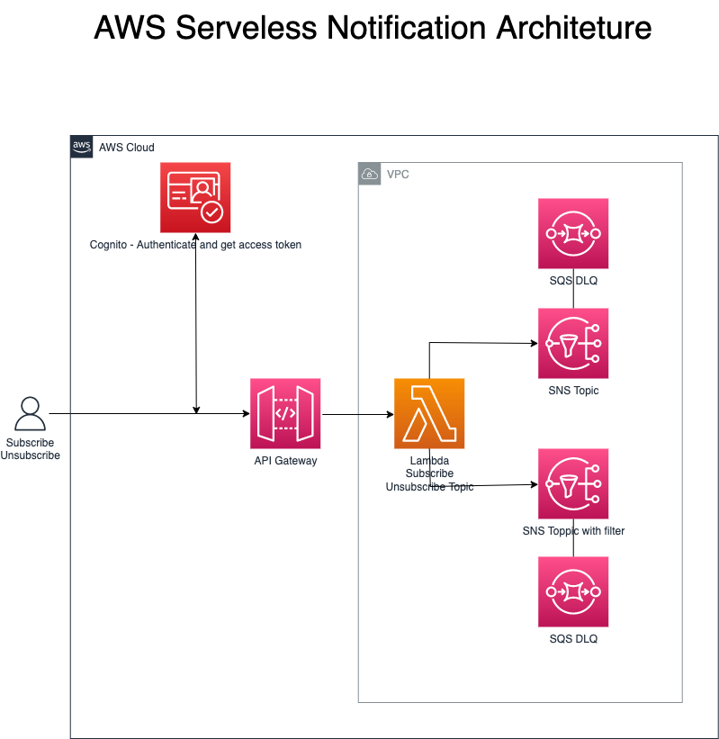
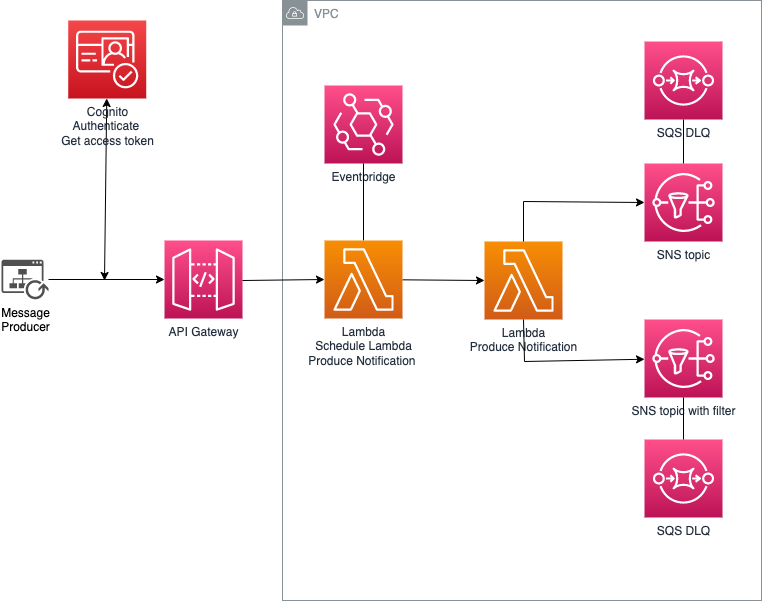
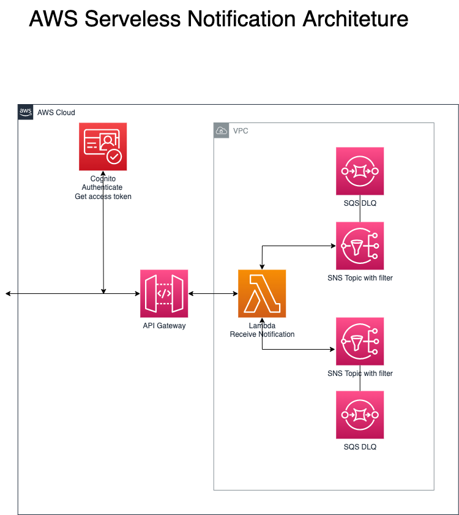
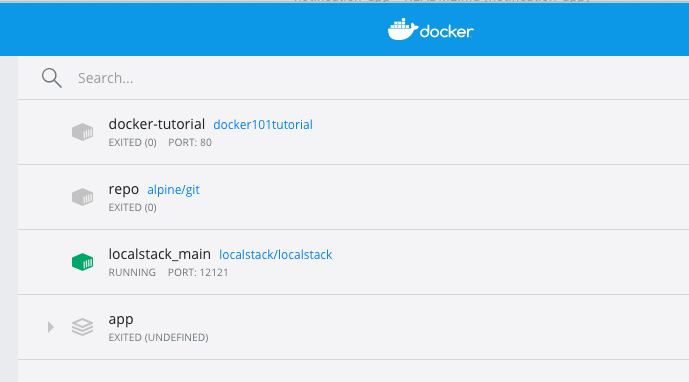

## Desenvolvimento da Solução
Para esse desafio pensei no modelo Publisher/Subscriber de arquitetura orientada a eventos. 

Baseado nos requisitos informados (funcionais e não funcionais), entendi que poderia propor uma solução utilizando AWS Serveless.

Dividi a implementação em 3 partes:
1. Subscribe/Unsubscribe
2. Publish
3. Notification

## Linguagem:
Este projeto está utilizando Maven com Java 11 e AWS SDK

## Framework

O framework usado para o deploy da infraestrutura é o SAM (AWS Serverless Application Model)

## 1 - Subscribe/Unsubscribe

A solução como um todo utiliza o Cognito para realizar a autenticação e autorização.

Essa primeira parte ficou responsável pela funcionalidade de opt-in e opt-out das notificações.

A Lambda responsável irá fazer as chamadas dos métodos da biblioteca AWS SDK de Subscribe e Unsubscribe de acordo com os dados fornecidos na chamada do API Gateway.

Para esta implementação serão criados 2 tópicos SNS:
- ofertas e descontos (notificação geral)
- avisos (notificação com filtro para os casos que a mensagem seja específica)

A fila SQS será criada e vinculada ao tópico do SNS a ser utilizada como destino para mensagens que não podem ser processada com sucesso. (Dead letter queue - DLQ)

## Serviços AWS utilizados

Cognito, API Gateway, Lambda para opt-in/opt-out dos Tópicos SNS com SQS DLQ

## Topologia - Subscribe Notification



## 2 - Publish

Nesse caso, a lambda ScheduleNotification será responsável a criar o Evento/Rule de agendamento da publicação. 

A lambda ProduceNotification é a responsável pela publicação das mensagens.

## Serviços AWS utilizados

Cognito, API Gateway, Lambda para agendamento com EventBrigde/Rule, Lambda para publicação nos Tópicos SNS com SQS DLQ

## Topologia - Publish Notification



## 3 - Notification

A última parte da implementação será responsável pela entrega da notificação.

## Serviços AWS utilizados

Cognito, API Gateway, Lambda para consulta SNS Topic com SQS DLQ

## Topologia - Receive Notification



## Instalação do Localstack 
Localstack é um emulador de serviços cloud (AWS) que roda em um único container. 
Nesse caso, com o localstack já instalado, utilizei ele com o Docker, com os comandos:

````
pip install --user localstack
````

````
TMPDIR=/private$TMPDIR localstack start --docker
````



## Deployment commands [DRAFT]

````
mvn clean package

# create an S3 bucket where the source code will be stored:

aws s3 mb s3://ndis2dc92jd2s


# copy the source code located in the target folder:

aws s3 cp target/notification-app.zip s3://ndis2dc92jd2s


# SAM will deploy the CloudFormation stack described in the template.yml file:

sam deploy --s3-bucket ndis2dc92jd2s --stack-name notification-stack --capabilities CAPABILITY_IAM

````

## Teste

Work in Progress.


## Cleanup

Para deletar os recursos criados:
```
aws cloudformation delete-stack --stack-name ticket-stack
```

## Requisitos

* [Create an AWS account](https://portal.aws.amazon.com/gp/aws/developer/registration/index.html) 
* [AWS CLI](https://docs.aws.amazon.com/cli/latest/userguide/install-cliv2.html) 
* [Git Installed](https://git-scm.com/book/en/v2/Getting-Started-Installing-Git)
* [AWS Serverless Application Model](https://docs.aws.amazon.com/serverless-application-model/latest/developerguide/serverless-sam-cli-install.html) 
* [Docker Desktop](https://www.docker.com/products/docker-desktop/)
* [Localstack](https://github.com/localstack/localstack)


## Mais informações

* [Swager - NotificationAPI](https://portal.aws.amazon.com/gp/aws/developer/registration/index.html)
* [Status atividade concluída](https://portal.aws.amazon.com/gp/aws/developer/registration/index.html)